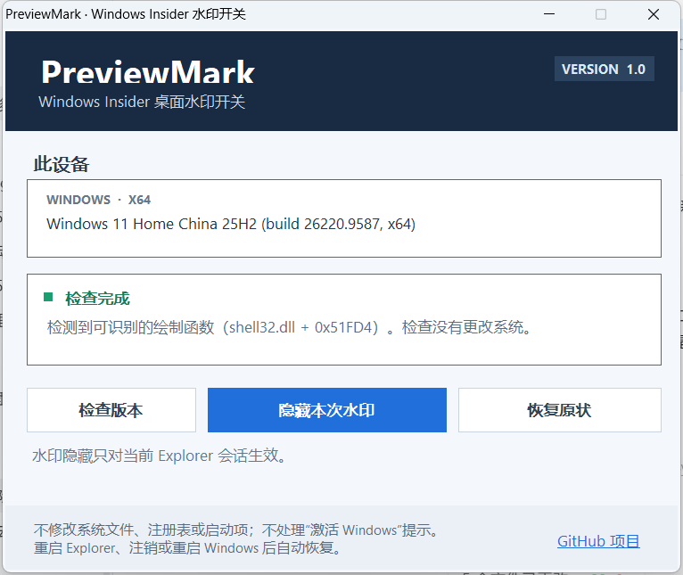

# PreviewMark

**PreviewMark 1.0** 是 Windows Insider 桌面构建水印的轻量、可逆开关。它只修改当前 Explorer 会话中的内存；重启 Explorer、注销或重启 Windows 后自动恢复。

[](https://github.com/wzs0512/PreviewMark/releases/tag/v1.0.0)

[](LICENSE)

**快速下载：** [图形界面版](https://github.com/wzs0512/PreviewMark/releases/download/v1.0.0/PreviewMark.exe) · [命令行版](https://github.com/wzs0512/PreviewMark/releases/download/v1.0.0/PreviewMark.Cli.exe) · [SHA-256 校验值](https://github.com/wzs0512/PreviewMark/releases/download/v1.0.0/SHA256SUMS.txt) · [全部发行文件](https://github.com/wzs0512/PreviewMark/releases/tag/v1.0.0)



## 使用

1. 从 [v1.0 发行页](https://github.com/wzs0512/PreviewMark/releases/tag/v1.0.0) 下载 `PreviewMark.exe`。
2. 打开程序。它会先检查当前 Windows 构建；检查不会修改系统。
3. 点击“隐藏本次水印”。要重新显示时，点击“恢复原状”。

隐藏只作用于当前 Explorer 会话。Explorer 重启、注销或重启 Windows 后，补丁会自动消失。

## 命令行

```powershell
.\PreviewMark.Cli.exe --version
.\PreviewMark.Cli.exe --scan
.\PreviewMark.Cli.exe --self-check
.\PreviewMark.Cli.exe --apply
.\PreviewMark.Cli.exe --restore
```

`--scan` 只读取系统 DLL。`--self-check` 只测试临时分配内存中的写入和恢复，不修改 Explorer。扫描结果不唯一或构建不匹配时，程序会停止。

## 适用范围

- Windows x64 Insider 预览版桌面构建水印
- 不处理“激活 Windows”提示，也不改变 Windows 授权状态
- 不改写系统文件、注册表或开机启动项
- 仅在 Insider 水印绘制结构兼容的构建上工作；Windows 更新可能改变绘制实现

## 构建

在 x64 Windows PowerShell 中运行：

```powershell
.\Build.ps1
```

构建使用 Windows 自带的 .NET Framework C# 编译器与 WinForms，不需要额外下载包。

## 致谢

目标定位思路参考了 [UWD3](https://github.com/jcnnik/uwd3) 的公开说明。PreviewMark 使用独立的 C# 实现；第三方许可信息见 [THIRD_PARTY_NOTICES.md](THIRD_PARTY_NOTICES.md)。

